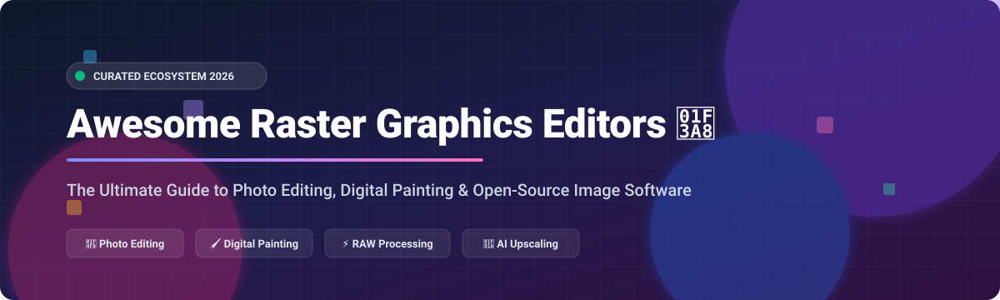

# 🎨 Awesome Raster Graphics Editors

  

## 🌟 Overview & Ecosystem Guide

A curated, comprehensive list of top **SaaS platforms**, **commercial software**, and **open-source GitHub projects** for raster graphics editing, photo manipulation, digital painting, RAW image processing, and AI upscaling. 

Whether you are a professional photographer seeking an alternative to Adobe Photoshop, an illustrator looking for open-source digital painting suites like Krita, or a developer building web-based canvas tools, this repository covers the best software available.

> **Keywords**: raster graphics editor, photo editor, digital painting, photoshop alternatives, GIMP, Krita, RAW processing, open source image editor, photo manipulation, AI image upscaler.

---

## 📑 Table of Contents

- [☁️ SaaS & Commercial Platforms](#️-saas--commercial-platforms)
- [🔓 Open-Source GitHub Projects](#-open-source-github-projects)
- [🤝 How to Contribute](#-how-to-contribute)
- [📈 Star History](#-star-history)
- [💖 Support & Sponsorship](#-support--sponsorship)
- [⚠️ Disclaimer](#️-disclaimer)

---

## ☁️ SaaS & Commercial Platforms

📊 **Market Overview**: The global raster graphics & photo editing software market is estimated at **~$3.8 Billion USD** (2026). The sector is **highly concentrated at the enterprise top** dominated by Adobe Photoshop, while remaining **moderately fragmented across specialized desktop, web-based, and indie alternatives**.

The following commercial and hosted platforms lead the market, sorted by parent company size / valuation in descending order:

| 🏢 Product / Platform | 💰 Starting Tier Price | 🎁 Free Tier / Trial Limit | 📊 Company Size / Valuation | 🎯 Best Use Case |
| :--- | :--- | :--- | :--- | :--- |
| **[Pixelmator Pro](https://www.pixelmator.com/pro/)** 🍏 | $49.99 one-time payment | 7-day free trial (Full features) | **~$3.4 Trillion Market Cap** *(Acquired by Apple)* | Native macOS photo editing & ML enhancements |
| **[Windows Paint](https://www.microsoft.com/en-us/windows/paint)** 🪟 | Free (Included with Windows OS starting at $139) | Free forever (Pre-installed OS utility) | **~$3.1 Trillion Market Cap** *(Microsoft)* | Basic quick cropping, annotations & simple edits |
| **[Adobe Photoshop](https://www.adobe.com/products/photoshop.html)** 🖼️ | $22.99 / month (Single App plan) | 7-day free trial (Full access to all AI tools) | **~$240 Billion Market Cap** *(Adobe Inc.)* | Industry-standard professional photo retouching & compositing |
| **[Affinity Photo](https://affinity.serif.com/en-us/photo/)** 🎨 | $69.99 one-time payment | 30-day free trial (Unrestricted desktop features) | **~$26 Billion Valuation** *(Serif / Canva)* | Professional non-subscription Photoshop alternative |
| **[Corel PaintShop Pro](https://www.paintshoppro.com/)** 🖌️ | $79.99 one-time payment | 30-day free trial (Full suite evaluation) | **~$1.0 Billion Valuation** *(Alludo / Vector Capital)* | Budget-friendly desktop photo editing for Windows |
| **[Photopea](https://www.photopea.com/)** 🌐 | $5.00 / month (Premium ad-free tier) | Free forever (All features unlocked, supported by ads) | **~$2.5 Million ARR** *(Indie / Ivan Kutskir)* | In-browser Photoshop replacement with PSD & Sketch support |
| **[Sumo Paint](https://sumo.app/)** 💻 | $9.00 / month (Sumo Pro tier) | Free forever (Basic tools & filters, ad-supported) | **~$500 Thousand ARR** *(Sumo App Suite)* | Quick browser-based image manipulation & digital art |

---

## 🔓 Open-Source GitHub Projects

The open-source raster graphics ecosystem provides powerful, software-sovereign alternatives for photo manipulation, painting, RAW workflow, and AI image enhancement.

The table below is sorted by **GitHub Star Count** (descending), with badges linking directly to each repository's stargazers page.

| 📦 Repository | ⭐ Star Count | 📜 License | 🎯 Description & Highlights |
| :--- | :---: | :---: | :--- |
| **[Upscayl](https://github.com/upscayl/upscayl)** |  | `AGPL-3.0` | **Free & Open Source AI Image Upscaler**. Uses Real-ESRGAN to enlarge images 4x-8x without loss of detail. Cross-platform GUI. |
| **[Krita](https://github.com/KDE/krita)** |  | `GPL-3.0` | **Premier Open-Source Digital Painting Suite**. Built for concept artists, illustrators, and animators with 100+ brush engines and wrap-around mode. |
| **[GIMP](https://github.com/GNOME/gimp)** |  | `GPL-3.0` | **GNU Image Manipulation Program**. De facto open-source Photoshop alternative with extensive plugin ecosystem, scripting (Python/Scheme), and layers. |
| **[Darktable](https://github.com/darktable-org/darktable)** |  | `GPL-3.0` | **Open-Source Photography Workflow & RAW Developer**. Virtual lighttable and darkroom for non-destructive RAW photo processing. |
| **[OpenToonz](https://github.com/opentoonz/opentoonz)** |  | `BSD-3-Clause` | **2D Animation & Raster Drawing Suite**. Production-grade software used in commercial animation studios for raster/vector artwork and FX. |
| **[IOPaint](https://github.com/Sanster/IOPaint)** |  | `Apache-2.0` | **AI-Powered Image Inpainting & Object Removal**. Open-source alternative to Photoshop's Content-Aware Fill using modern diffusion models. |
| **[Inkscape](https://github.com/inkscape/inkscape)** |  | `GPL-3.0` | **Vector Graphics Editor**. SVG-native tool included as an essential counterpart to raster editing for logo design and graphics compositing. |
| **[RawTherapee](https://github.com/RawTherapee/RawTherapee)** |  | `GPL-3.0` | **Powerful RAW Image Converter & Processing System**. Features demosaicing algorithms, advanced color tweaking, and noise reduction. |
| **[Paint.NET](https://github.com/paintdotnet/paint.net)** |  | `MIT` | **Fast & Intuitive Windows Image Editor**. Lightweight raster editor with layer support, special effects, and rich community plugin support. |
| **[DigiKam](https://github.com/KDE/digikam)** |  | `GPL-2.0` | **Professional Photo Management & Organizer**. Features face recognition, geotagging, and batch photo editing routines. |
| **[Pinta](https://github.com/PintaProject/Pinta)** |  | `MIT` | **Cross-Platform Painting & Image Editing**. Simple, lightweight GTK#-based editor inspired by Paint.NET. |
| **[MyPaint](https://github.com/mypaint/mypaint)** |  | `GPL-2.0` | **Distraction-Free Digital Painting Tool**. Features an infinite canvas and natural brush engine designed for pressure-sensitive graphics tablets. |
| **[PhotoGIMP](https://github.com/Diolinux/PhotoGIMP)** |  | `GPL-3.0` | **Photoshop UX Patch for GIMP**. Transforms GIMP's UI, shortcut layout, and tool structure to mirror Adobe Photoshop. |
| **[Pencil2D](https://github.com/pencil2d/pencil2d)** |  | `GPL-2.0` | **Lightweight 2D Hand-Drawn Animation Software**. Supports seamlessly switching between raster and vector drawing layers. |
| **[PhotoDemon](https://github.com/tannerhelland/PhotoDemon)** |  | `BSD-2-Clause` | **Portable Windows Photo Editor**. Fully macro-recordable raster editor requiring no installation. |
| **[LazPaint](https://github.com/bgrabitmap/lazpaint)** |  | `GPL-3.0` | **Lazarus/FreePascal Image Editor**. Lightweight raster graphics editor supporting anti-aliasing layers and 3D object rendering. |
| **[PhotoFlare](https://github.com/PhotoFlare/photoflare)** |  | `GPL-3.0` | **Simple C++/Qt Image Editor**. Quick photo adjustments and batch filtering tailored for low-resource systems. |
| **[Seashore](https://github.com/sea-shore/Seashore)** |  | `GPL-2.0` | **Native macOS Cocoa Image Editor**. Light GIMP-derived photo editor featuring Cocoa UI integration and pressure sensitivity. |
| **[mtPaint](https://github.com/wjaguar/mtPaint)** |  | `GPL-3.0` | **Lightweight Pixel Art & Indexed Palette Editor**. Tailored for creating retro game sprites and pixel art illustrations. |
| **[Phatch](https://github.com/stani/phatch)** |  | `GPL-3.0` | **Batch Photo Processor & Action Automator**. Automates resizing, watermarking, rotating, and filtering image batches. |

---

## 🤝 How to Contribute

Contributions are warmly welcomed! Help keep this awesome list comprehensive and up to date.

1. **Fork** the repository 🍴
2. **Add/Update** an entry in `README.md` following the tabular formatting structure.
3. Provide factual descriptions, starting prices, free tier limits, and accurate GitHub links.
4. Open a **Pull Request** 🚀 with a brief description of your additions.

---

## 📈 Star History

---

## 💖 Support & Sponsorship

Thank you for visiting and using this repository! If you find this curated list helpful for your workflow or software research, please consider supporting the project:

- ⭐ **Star** this repository to increase its visibility.
- 🔀 **Fork & Share** it with fellow photographers, designers, and open-source advocates.
- ☕ **Buy Me a Coffee**: Support ongoing open-source curation and project maintenance via the [GitHub Sponsors Dashboard](https://github.com/sponsors/ishandutta2007).

---

## ⚠️ Disclaimer

- This is a **community-curated** list intended solely for informational and educational purposes.
- Prices, valuations, and software feature sets are accurate as of **October 2026** and may change over time.
- Raster graphics software may process sensitive visual media. **Verify AI & cloud features** to ensure compliance with privacy regulations before uploading sensitive artwork or photos.
